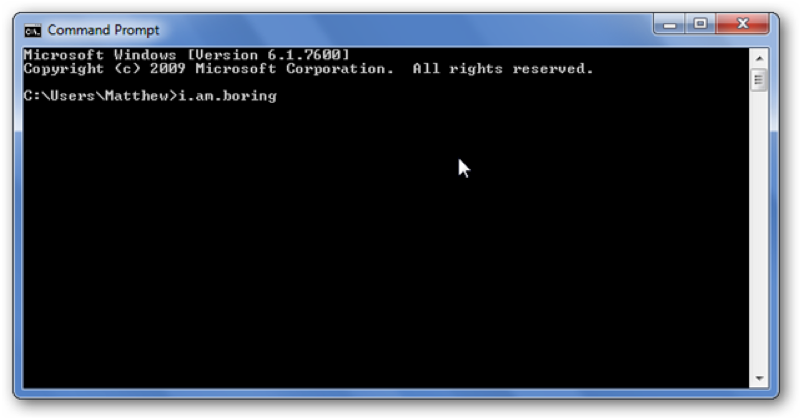

# The command line

The command line (also called command-line interface, command prompt, shell), is a text-based application for viewing, handling, and manipulating files on your computer.

The general syntax of any command in the command line is: **command + [optional parameters] + [optional flags]**

* **Command:** Name of the command, e.g. cd, git add
* **Parameter:** Specifies the command, e.g. `cd Desktop` _Desktop_ specifies in which directory to move to
* **Flag:** Optional boolean parameter, e.g. `ls -l` or `dir /b` 

**Note:** The commands, parameters and flags are always separated by whitespaces.

 
**More important note:** Avoid file names containing whitespaces, because that might lead to problems when executing commands, e.g. 

`$ cd ./my folder` would be interpreted as a command with two parameters _./my_ and _folder_. 

Setting quotation marks would solve the problem as well, but it's better to generally avoid whitespaces in file paths. 

## Commands

The commands on Windows and Unix (Max OS, Linux) systems are a bit different. If you want to use the Unix commands on Windows, use the PowerShell or the GitBash. 

|     Windows command    	|     Mac OS / Linux command  |     Description  |     Example   |
|-	|-	|-	|-	|
|     exit    	|     exit    	|     close the window   |     exit   |
|     cd    	|     cd    	|     change directory,     When changing hard drives   (C:\ to   M:\) execute   M:\ afterwards    	|     cd M:\Documents |
|     cd    	|     pwd    	|     print   working   directory  |     cd    |
|     dir    	|     ls    	|     list directories/files    	|     dir    	|
|     copy    	|     cp    	|     copy file    	|     copy c:\test\test.txt c:\windows\test.txt    	|
|     move    	|     mv    	|     move file    	|     move c:\test\test.txt   c:\windows\test.txt    	|
|     mkdir    	|     mkdir    	|     Make (new) directory    	|     mkdir testdirectory    	|
|     rmdir (or del)    	|     rm    	|     Remove directory    	|     del c:\test\test.txt    	|
|     rmdir /S    	|     rm -r    	|     Remove directory recursivly    	|     rm -r testdirectory    	|
