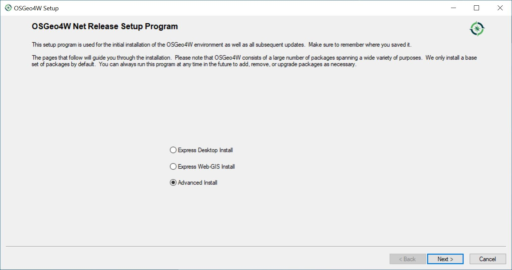
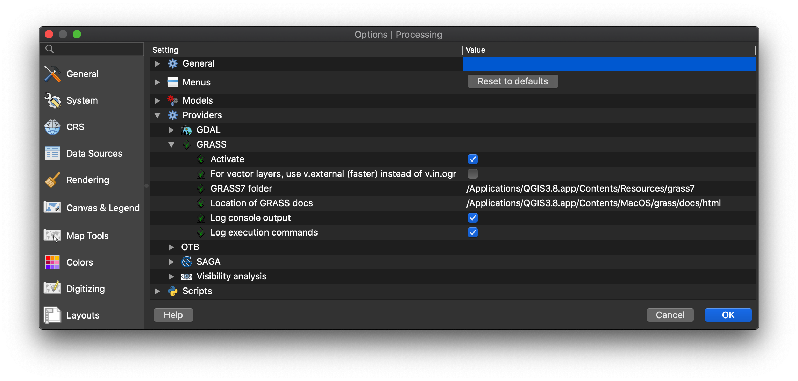

# FOSSGIS: Course preparation assignment

Work through the following tasks before the next seminar on **Wed 27.10.2021.** 

If you have **questions or problems, post them in the _Technical problems_ channel in Microsoft Teams.**

## 1. Apply for a Microsoft Teams account

Apply for a Microsoft Teams account at [URZ](https://it-service.uni-heidelberg.de/anfrage/teams_benutzer_freischalten). Once you get your account, I will add you to the FOSSGIS course.

## 2. Create a GitHub account

Create a GitHub account on [github.com](https://github.com/), if you don't have one already. Send your GitHub name to [christina.ludwig@uni-heidelberg.de](christina.ludwig@uni-heidelberg.de).

## 3. Install required software

If you are on Windows, follow these instructions. If you are on a different operating system, post it in the _Technical problems_ channel in Microsoft Teams or send an email to [christina.ludwig@uni-heidelberg.de](mailto:christina.ludwig@uni-heidelberg.de).

### Windows 

#### Install GIS software

1. Download the OSGeo4W Installer [here](https://trac.osgeo.org/osgeo4w/)
2. Run the installer and select "Advanced Installation" (Fortgeschrittene Installation). Click through the steps and keep the default values.

	

3. **Stop at "Choose packages" (Pakete wählen):** Select the following packages for installation. Click on "Skip" in the column _New_ (_Neu_) to select a package for installation. If a package is selected for installation, the version number will be shown in the column _New_ (_Neu_)

	**Section: Desktop**

	* grass: GRASS GIS version (7.8.6-1)
	* qgis-ltr: QGIS Desktop (3.16) [LTR stands for Long Term Release and is usually more stable]
	* saga: SAGA (7.8.2-12)

	**Section: Libs**

	* qgis-grass-plugin7: GRASS7 plugin for QGIS (3.20.3-1)

**Note:** Additional packages will be selected automatically which are needed to run the ones listed above. So just keep those as well.

	

#### Install git

Download the [git4windows installer](https://gitforwindows.org/) and install it on your computer.
	
----

### Mac OS

1. Download and install the following software [QGIS 3.16](https://qgis.org/en/site/forusers/download.html#).

2. In the menu go to Processing > Providers. Make sure that the paths to the GRASS7 folder is set.



3. Open the terminal and execute the command "gdalinfo". If you get the message "command not found" post it in the _Technical problems_ channel in MS Teams. 

----

### Linux

The QGIS Installation instructions are given in the [QGIS documentation](https://www.qgis.org/en/site/forusers/alldownloads.html#linux). Make sure to install both **QGIS 3.16** (qgis) and the **QGIS GRASS plugin** (qgis-plugin-grass)

```
sudo apt install qgis qgis-plugin-grass
```

**Note:** I am not sure if GRASS GIS is installed as well. If it is not available within the QGIS toolbox, install GRASS GIS 7.8 from [https://grass.osgeo.org/download/linux/](https://grass.osgeo.org/download/linux/).

##### 

When you install gdal

```
sudo apt install gdal-python
```


## 4. Learn how to use the command line

Watch the following command line tutorial videos: 

#### Windows

*  [Windows Command Line Tutorial - 1 - Introduction to the Command Prompt](https://www.youtube.com/watch?v=MBBWVgE0ewk&t=151s)
*  [Windows Command Line Tutorial - 2 - Listing Files and Directories](https://www.youtube.com/watch?v=7ABkcHLdG_A)

#### Mac / Linux

* [Absolute BEGINNER Guide to the Mac OS Terminal](https://www.youtube.com/watch?v=aKRYQsKR46I)

To practice using the command line, do the following exercises: 

1. Open the command line. 
2. Move into the folder containing the course material of the first FOSSGIS session. 
3. List all files. 
4. Move to the parent folder. 