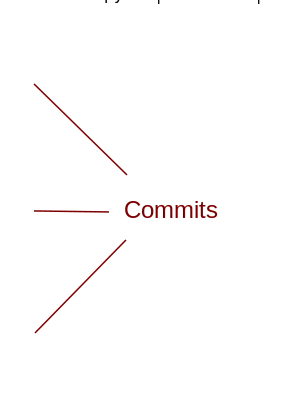
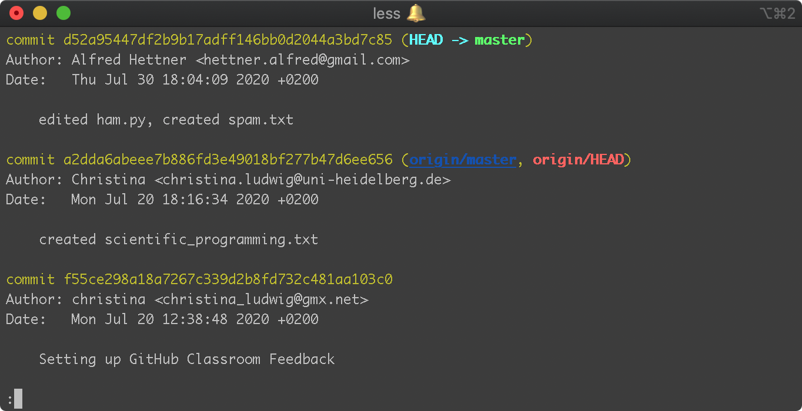

# Introduction to git

## 1. What is git? 

For a short explanation of the concept of git, watch the video ["What is Git? Explained in 2 Minutes!"](https://www.youtube.com/watch?v=2ReR1YJrNOM)

### git is a Version Control System

* A Version Control System is a software that **tracks the file changes** of all contributors within a project.
* Originally developed to **assist collaborative open source software development** by Linus Torvalds (Initiator of Linux development)
* The **user chooses which files are tracked** and which file changes are recorded.
* All tracked files of a project are stored in a **git repository** ("repo").


### git tracks file changes through *commits*

<center>
   
</center>


### *git status* shows the current state of the repository

```
  $ git status
```

<center></center>


### A *commit* records file changes within the *repository*

Adding files to the staging area, which will be included in the next commit.

```
$ git add ham.py
$ git add spam.txt
```

<center></center>


Creating the commit containing the files in the staging area:

```
$ git commit -m "edited ham.py, created spam.txt"
```


### git needs to know who is creating the commit

Registering your user name and email:

```
$ git config --global user.name "Alfred Hettner"
$ git config --global user.email "hettner.alfred@gmail.com"
```

**Note:** This has to be done only once. It does not have to be your GitHub user name or email.


### *git log* shows all commits of this repository

```
$ git log
```

<center></center>

**Note:** You can exit the log by typing "q", if you use the default command line editor *vim*.


### Synchronizing your local commits with a central git repository

<center></center>


###Connecting a local repository to a central repository

**Option 1:** Clone the repository to your computer:

```
$ git clone https://github.com/geoscripting/preparatory-assignment-hettner
```
    
**Option 2:** Create a local repository and connect it to a central repository:

```
$ git init
$ git remote add origin https://github.com/hettner/my_empty_repo.git
```

## How to use git? 

Below there are two videos showing you how to clone a repository and how to create and push commits to GitHub. Note that the **files and the URLs in the video will be different from yours**. I've added the commands that you should use according to the first FOSSGIS assignment below. 

**Note:** In the video the Git Bash is used instead of the normal Windows command prompt. 

In order to use git you need to have a **GitHub Account** and **git must be installed** on your computer.

### 1. Cloning the repository to your computer

In order to work on the files in the repository and to add new ones, you need to clone the repository to your computer. Use the following command to clone your forked repository for the first FOSSGIS assignment. 

**Note:** Replace the user name _hettner_ with your GitHub user name. 

```
$ git clone https://github.com/hettner/fossgis_assignment1
```

Click on the image below to watch the video tutorial. 

<a href="http://www.youtube.com/watch?feature=player_embedded&v=yfFbOUnbE1Y
" target="_blank"></a>


### 2. Synchronizing your changes with GitHub

When you create or edit files, you can track these changes and synchronise them with the remote repository on GitHub using the following git commands.

```
  $ git add methodology.md
  $ git commit -m "edited methodology.md"
  $ git push origin main
```

Click on the image below to watch the video tutorial. 

<a href="http://www.youtube.com/watch?feature=player_embedded&v=kVCLIPHfPDo
" target="_blank"></a>


## Resources

The Software Carpentry provides a good `git tutorial <http://swcarpentry.github.io/git-novice/>`_.
